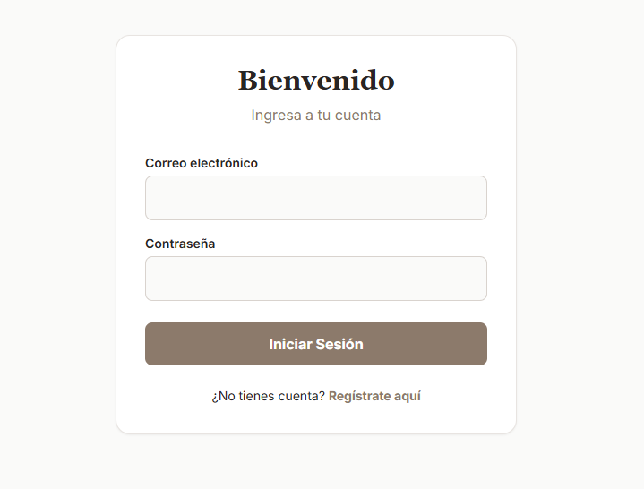
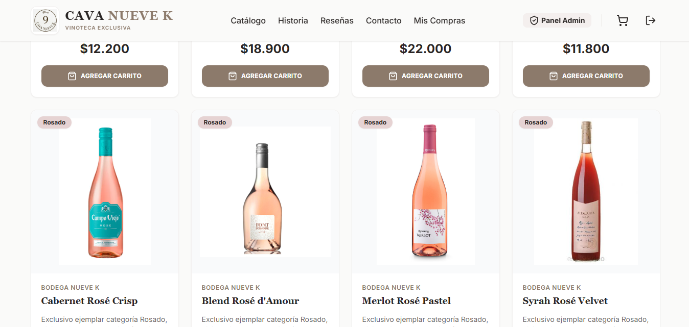
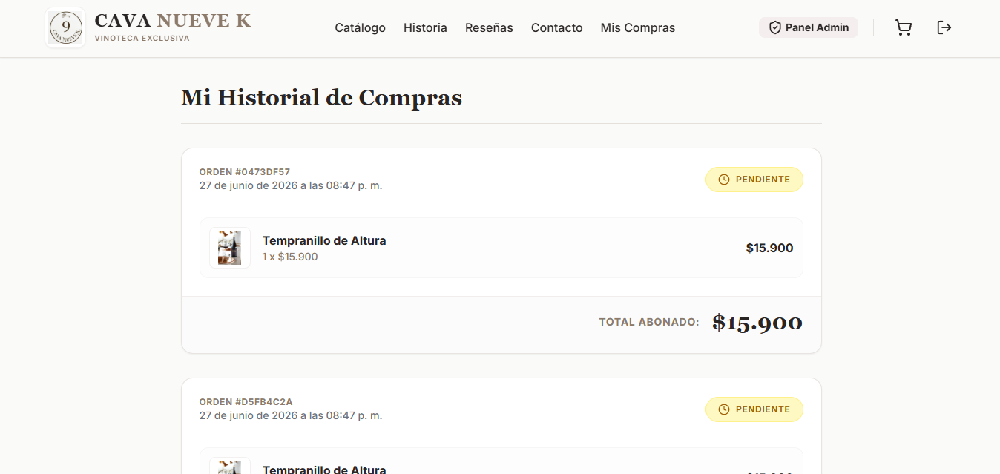
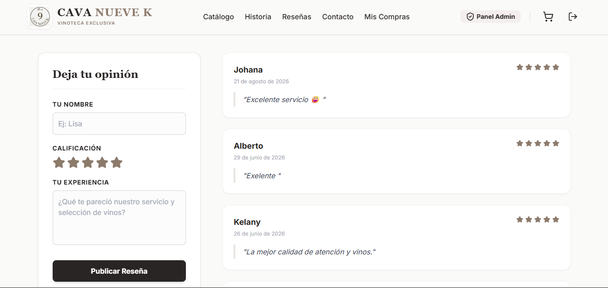
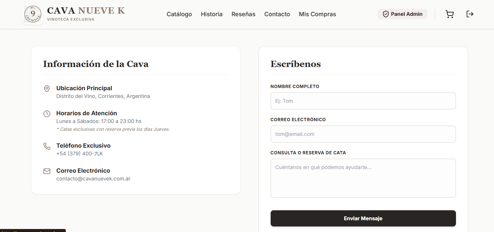
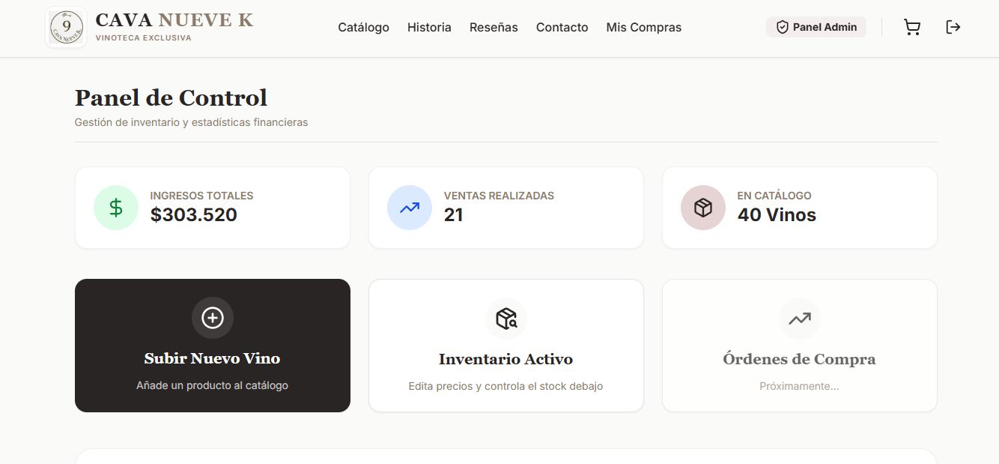
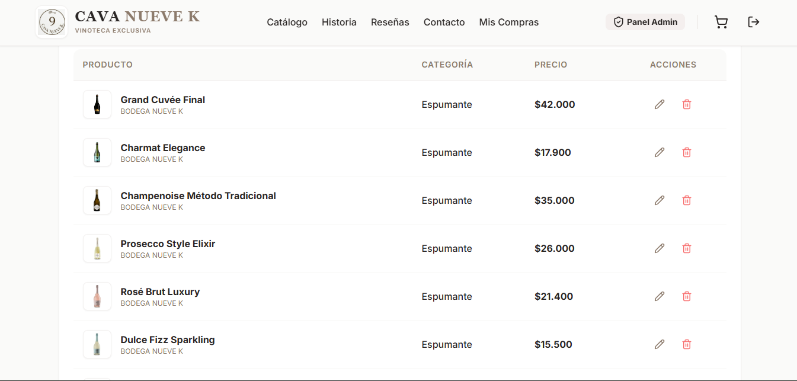

# 🍷 Cava Nueve K - E-Commerce Exclusivo & Sistema de Gestión

> Plataforma e-commerce premium con flujos de pago nativos automatizados, navegación segmentada, sistema de reseñas en tiempo real y un dashboard administrativo completo.

**🌐 Visitar E-Commerce Live:** [cava-nueve-k.vercel.app](https://cava-nueve-k.vercel.app/)

## 🚀 Mi Rol y Stack Tecnológico

*   **Rol:** Lead Fullstack Developer
*   **Frontend & Backend:** Next.js, Node.js
*   **Base de Datos & ORM:** TiDB Cloud (MySQL), Prisma ORM
*   **Integraciones:** Mercado Pago API

## 📌 El Desafío de Negocio

Las vinotecas exclusivas requieren entornos web que ofrezcan una experiencia de compra premium, pero también necesitan herramientas robustas en el "back-office" para gestionar su inventario, medir sus ingresos y fidelizar a sus clientes.

## 📱 Demostración Visual y Módulos Core

### 1. Autenticación Segura y Privacidad
Flujo de inicio de sesión (Email/Contraseña) diseñado para proteger la cuenta del cliente y habilitar accesos personalizados.

### 2. Catálogo Modular Dinámico
Interfaz de compra limpia y segmentada por categorías de vinos, optimizando la experiencia de usuario (UX) en la búsqueda de productos.

### 3. Panel de Cliente: Mis Compras
Módulo privado de auditoría donde cada usuario puede visualizar el estado y el historial completo de sus transacciones.

### 4. Fidelización y Feedback en Tiempo Real
Sistema interactivo que permite a los usuarios calificar su experiencia de compra y publicar opiniones visibles para la comunidad.

### 5. Captura de Leads y Eventos
Formulario de contacto estratégico integrado para la reserva de turnos en catas de vino presenciales.

### 6. Dashboard Financiero (Administrador)
Panel de control con métricas en vivo (Business Intelligence) que centraliza ventas realizadas, ingresos totales y volumen de artículos publicados.

### 7. Motor de Inventario y Operaciones (CRUD)
Interfaz segura para el equipo administrativo que permite crear, editar y eliminar vinos del catálogo en tiempo real.

